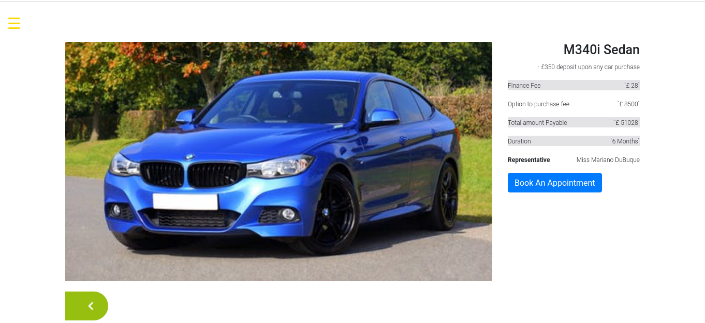

# Car- Viewer
[](https://github.com/RichardLitt/standard-readme)
[](https://david-dm.org/dwyl/esta)



> Is a Web-based app that performs a set of actions to get a list of car data from https://www.metaweather.com/ as json format. Where car with specific model name with price, fee to take on rent, current discount, and representative name. A authenticated user can book a schedule for a test drive, but in number of limited cities. User can see the list of appointment that he has booked. Nice transforming Nav Items to navigate user properly. The design was taken from [here](https://www.behance.net/gallery/26425031/Vespa-Responsive-Redesign). Design credit goes to [Murat Korkmaz](https://www.behance.net/muratk)

## Table of Contents

- [What_It_Does?](#What_It_Does?)
- [Built_With](#Built_With)
- [Install](#install)
- [Usage](#usage)
- [Maintainers](#maintainers)
- [Contact](#contact)
- [Contributing](#contributing)
- [License](#license)


## What_It_Does?
```
1. Takes username, email, password to register a user.
2. User authentication cover by taking email and password.
3. Renders a list of cars with related informations. Such as,
..1. Car model
..2. Price
..3. Payable price
..4. Minimum deposit to test a car
..5. Representative name
4. Users appointment info.
5. Details of a specific car model.

```
1. Run `yarn install` It will install all the dependencies required by the project.

## Built_With
```
1. React
2. Redux
3. Axios
4. React
```
## Install
```
1. Clone the repository: ` git clone git@github.com:shshamim63/car-viewer-react.git`
2. Enter into the folder: `cd car-viewer-react`
3. Run `yarn start` to start the development server. It will automatically open the page in your default browser.
4. Run `yarn run build` to get a deployable version.
```
## Usage

Project interact with an API, created in Ruby on Rails. Here is the [link](git@github.com:shshamim63/car-viewer-api.git) of the repository.
## Maintainers

[@Shakhawat Hossain](https://github.com/Shakhawat Hossain)

## Contact
You can contact with me at:
1. [Linkedin](https://www.linkedin.com/in/shakhawathossainshamim/)
2. [Twitter](https://twitter.com/Shshamim090)

## Contributing

PRs accepted.

Small note: If editing the README, please conform to the [standard-readme](https://github.com/RichardLitt/standard-readme) specification.

## License

MIT © 2019 Shakhawat Hossain